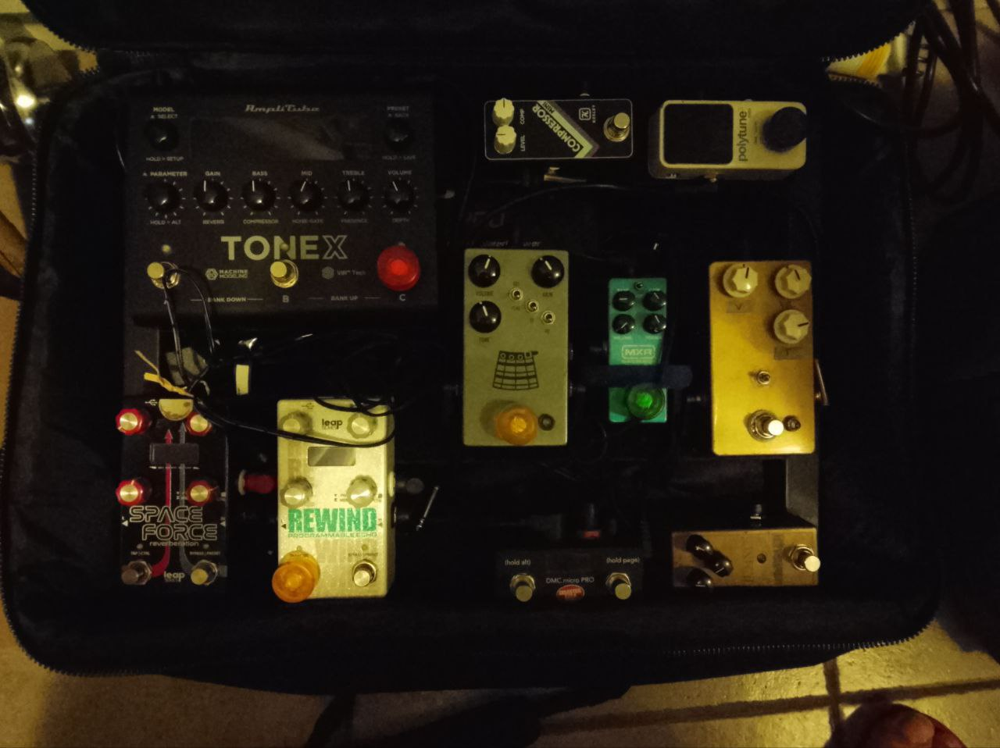
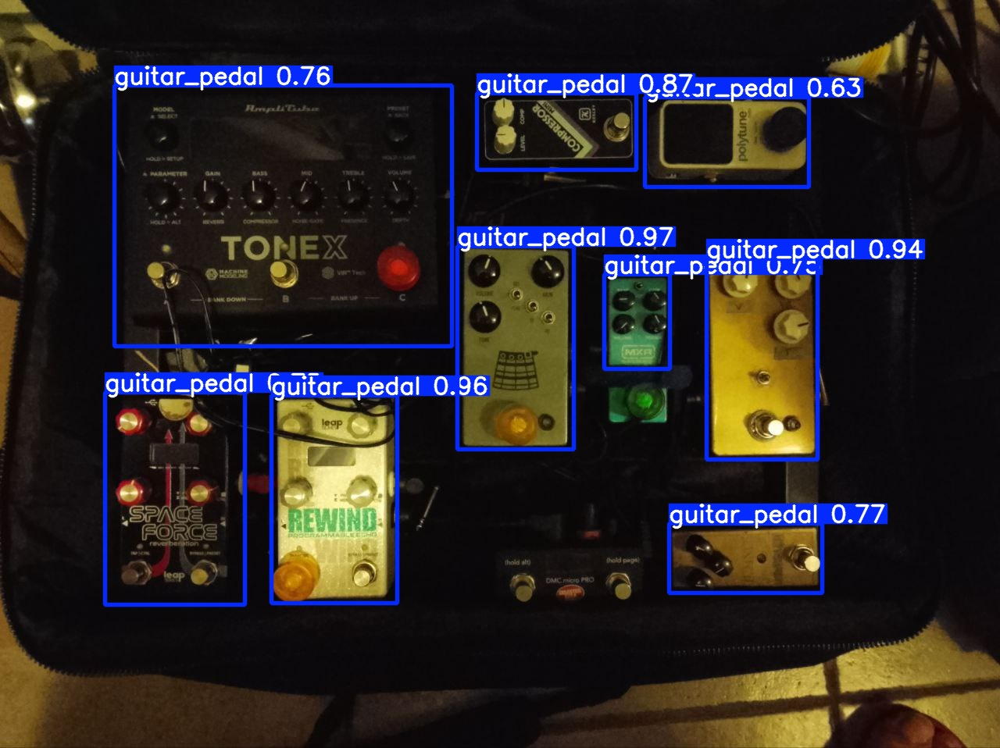

# Pedal Detector (YOLOv8)

Object detection pipeline for identifying guitar pedals in pedalboard photos using YOLOv8n.

This project focuses on a practical end-to-end ML workflow in Python: dataset preparation, reproducible training, CLI inference, and model export.

## Why This Project

- Real-world computer vision task on custom data.
- Complete workflow from raw labels to inference artifacts.
- Lightweight model choice for fast inference.

## Results Snapshot

Validation split: 25 images (trained on 139 images).

| Metric | Value |
|---|---:|
| mAP@50 | 0.975 |
| mAP@50-95 | 0.735 |
| Precision | 0.941 |
| Recall | 0.941 |

## Example Prediction

| Original | YOLOv8 Prediction |
|---|---|
|  |  |

Generated with: `python predict.py --source my_pedals.jpg --weights runs/detect/pedal_detector/weights/best.pt --conf 0.25 --iou 0.45 --save`.

## Quick Start

```bash
git clone https://github.com/<your-user>/pedal_detector.git
cd pedal_detector
python -m venv .venv
# Windows PowerShell
.venv\Scripts\Activate.ps1
pip install -r requirements.txt
```

Download pretrained weights from GitHub Releases:

```bash
curl -L -o best.pt https://github.com/escobar-david/pedal_detector/releases/download/yolo-pedalboards/best.pt
python predict.py --source my_pedals.jpg --weights best.pt --save
```

## Reproduce Training

```bash
python split_dataset.py --source-images images --source-labels labels --output-dir datasets --train-ratio 0.85 --seed 42
python train.py --data data.yaml --epochs 100 --batch 16 --imgsz 640 --device 0 --seed 42 --project runs/detect --name pedal_detector
python predict.py --source my_pedals.jpg --weights runs/detect/pedal_detector/weights/best.pt --save
```

CPU-only training:

```bash
python train.py --device cpu
```

## CLI Usage

```bash
python train.py --help
python predict.py --help
python split_dataset.py --help
python interactive.py --help
```

### Common CLI examples

Train with explicit run naming and seed:

```bash
python train.py --data data.yaml --epochs 50 --batch 16 --seed 123 --project runs/detect --name exp_seed123
```

Predict on CPU with custom thresholds:

```bash
python predict.py --source my_pedals.jpg --weights runs/detect/pedal_detector/weights/best.pt --device cpu --conf 0.3 --iou 0.45 --save
```

Run interactive mode on CPU and explicit weights:

```bash
python interactive.py --device cpu --weights runs/detect/pedal_detector/weights/best.pt
```

Split data with custom output and deterministic shuffle:

```bash
python split_dataset.py --source-images images --source-labels labels --output-dir datasets --train-ratio 0.9 --seed 7
```

### Notes

- `predict.py` now exits with a non-zero code when `--source` or `--weights` is invalid.
- `train.py` supports reproducible runs via `--seed` and portable output paths via `--project` and `--name`.

### Exit codes

- `train.py`: returns `0` on successful execution.
- `split_dataset.py`: returns `0` on successful split, non-zero for invalid `--train-ratio` or missing source directories.
- `predict.py`: returns `0` on successful inference, non-zero when input source or weights are missing/invalid.
- `interactive.py`: returns `0` on normal session exit (`q`/`quit`/`exit`), non-zero if weights cannot be resolved at startup.

## Project Structure

```text
pedal_detector/
|-- data.yaml
|-- split_dataset.py
|-- train.py
|-- predict.py
|-- interactive.py
|-- requirements.txt
|-- images/                # raw images (local/private by default)
|-- labels/                # raw labels (local/private by default)
|-- datasets/              # generated train/val split
`-- runs/                  # training and inference outputs
```

## Design Choices

- Model: YOLOv8n for speed and compact size.
- Transfer learning from pretrained weights.
- Augmentation tuned for small dataset:
- HSV jitter
- Horizontal flips
- Moderate rotation (+/-10 degrees)
- Mosaic and mixup

## Limitations

- Single class only: `guitar_pedal`.
- Small dataset size may reduce generalization.
- No instance segmentation or pedal-type classification yet.

## Roadmap

- Multi-class labels by pedal type.
- Structured error analysis and evaluation reports.
- Dockerized inference service.

## Dataset and Rights

Before publishing images/labels publicly, confirm you have redistribution rights for every photo and annotation.

## License

MIT. See `LICENSE`.
